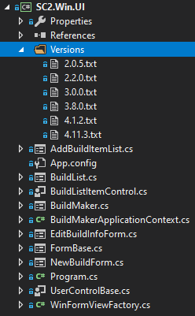

# sc2buildmaker-win
Hi to all of you who interested in programming and like StarCraft 2 :)!.

This repository is a part of codebase which I was working on thru several years in order to implement SC2 Build Maker android application:
https://play.google.com/store/apps/details?id=com.sc2toolslab.sc2bmfree
https://play.google.com/store/apps/details?id=com.sc2toolslab.sc2bmfull

https://youtu.be/Y4cYK_L-Q1k
(The video was recorder for outdated version but it still allows to see how the app works).

***
sc2buildmaker-Win - is .NET 4.5 C# codebase which I used to implement Starcraft2 economy model simulator. It also contains simple WinForms application which has similar functionality to SC2BuildMaker android app - it allows to create build orders. I also used this app to  generate SC2BuildMaker version config file which contains all required infromation regarding each unit/building/upgrade and build requirements for each item.

SC2.Win.UI - .NET 4.5 C# WinForms application which I used to generate SC2BuildMaker version config files and to test build orders.

